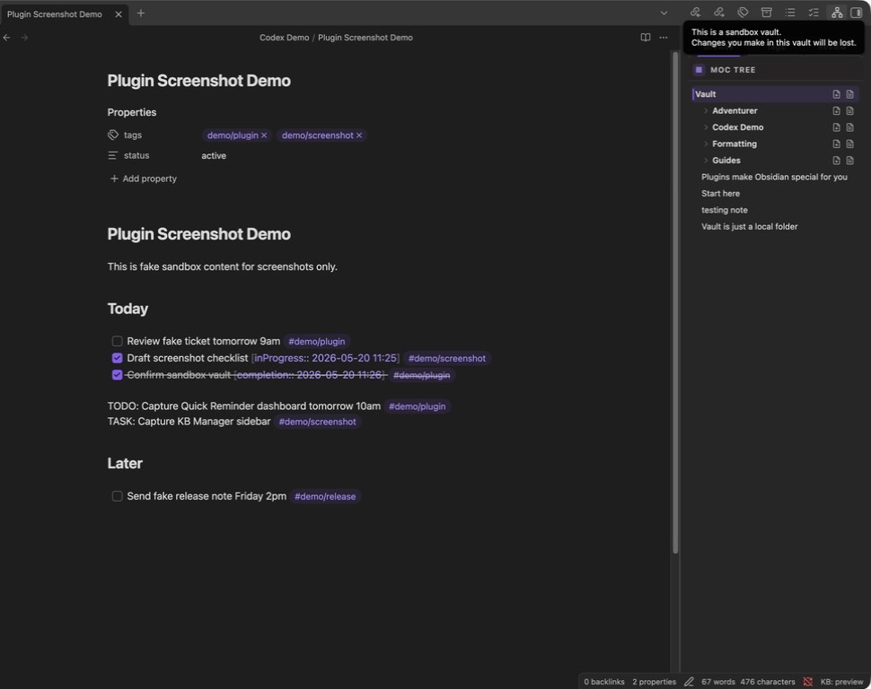
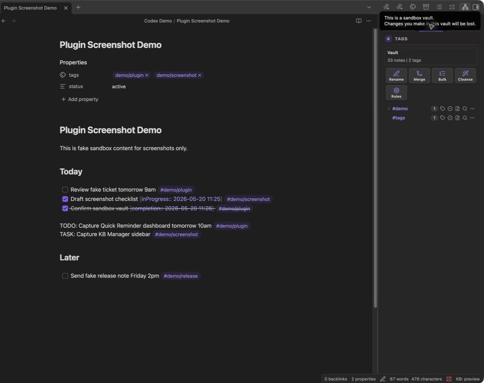
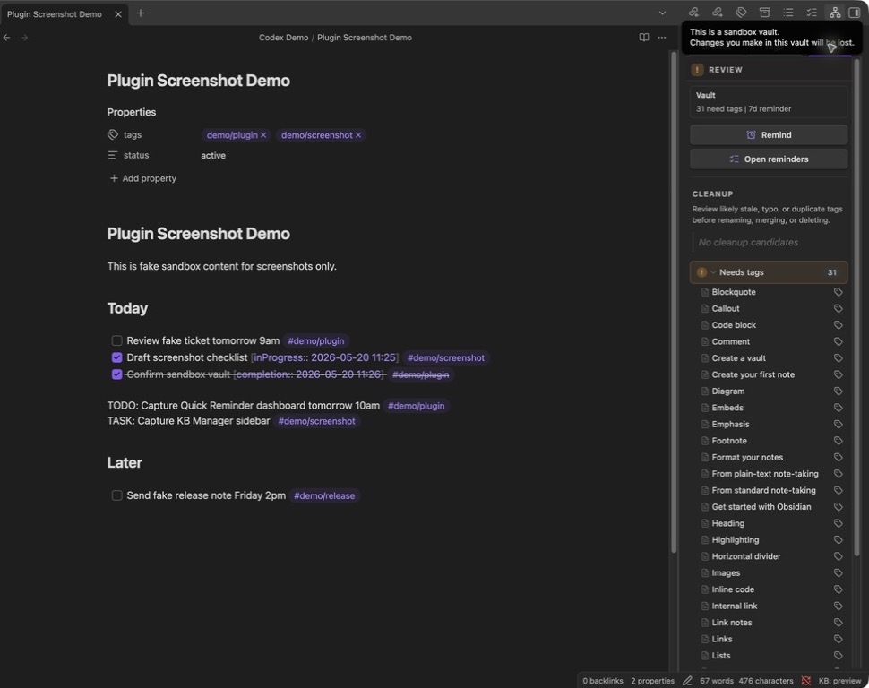

# KB Manager

KB Manager is an Obsidian plugin for maintaining a MOC-first knowledge base.
It keeps folder MOCs, inline MOC sections, note TOCs, section indexes, and tag navigation in sync with your vault.

## What It Does

- Builds a live index of vault folders, notes, headings, and tags
- Generates dedicated `MOC.md` files for folders
- Injects inline MOC sections into configured notes
- Injects per-note TOC sections from note headings
- Generates folder-level `INDEX.md` files from note headings
- Shows a sidebar with Browse, Tags, and Review tabs for MOC navigation, scoped tags, cleanup, and review reminders
- Adds notes from folder and tag actions, and can initialize KB frontmatter on new notes
- Cleans up tags with rename, merge, delete, bulk add/remove/rename, invalid tag cleansing, and folder/regex tag rules
- Runs background updates on a configurable interval
- Provides manual rebuild and sidebar ribbon actions that preserve their ribbon order
- Runs on desktop and mobile Obsidian (`isDesktopOnly: false`)

## Safety Model

KB Manager only overwrites files or sections it owns:

- Dedicated generated MOC files are marked with `kb-managed: true`
- Inline sections are bounded by:
  - `<!-- kb-manager:moc:start -->`
  - `<!-- kb-manager:moc:end -->`
  - `<!-- kb-manager:toc:start -->`
  - `<!-- kb-manager:toc:end -->`
- Files without valid delimiters are skipped for inline updates

The plugin is intended for local vaults and does not make network calls.

## Integrations

KB Manager owns KB structure, MOCs, TOCs, metadata, and review workflows. It can optionally hand off "review this KB area" signals to a companion reminder plugin.

- **Quick Reminder (optional).** If the [Quick Reminder](https://github.com/schylerchase/quick-reminder) plugin is installed and enabled, **Create KB update reminder** schedules a local reminder in Quick Reminder.
- **Fallback (always available).** If Quick Reminder is missing, disabled, or its API is unavailable, KB Manager writes a plain Markdown task to the note configured under **Settings -> KB Manager -> KB update task file** (default `KB Updates.md`). Review tasks are never lost.

Integration is resilient. KB Manager does not crash, fail, or block any of its core MOC, TOC, sidebar, or rebuild features if Quick Reminder is absent. KB Manager does not bundle or copy any Quick Reminder code.

## Commands

KB Manager registers these commands. Obsidian shows each one prefixed with `KB Manager:` in the command palette.

| Command | What it does |
|---|---|
| Rebuild now | Manually re-index the vault and run generators. |
| Insert MOC here | Insert MOC delimiters at the cursor in the active note. |
| Insert note TOC here | Insert note TOC delimiters at the cursor in the active note. |
| Open sidebar | Open the KB Manager sidebar view. |
| New KB note here | Create a new note in the active folder. |
| New MOC note here | Create a new note seeded as a folder MOC. |
| New TOC note here | Create a new note seeded as a per-note TOC. |
| Add tags to current note | Append tags to the active note. |
| Initialize properties for current note | Add KB property frontmatter to the active note. |
| Create KB update reminder | Schedule a KB review via Quick Reminder, or write a Markdown review task fallback. |
| Delete tag everywhere... | Remove a selected tag from every indexed note after confirmation. |
| Rename tag... | Rename a selected tag across the vault, with a preview before applying. |
| Merge tag into... | Merge one existing tag into another. |
| Show tag stats... | Show note counts and folder spread for a selected tag. |
| Bulk tag files... | Add, remove, or rename tags across files selected by folder or tag. |
| Move inline tags to frontmatter (active note) | Move inline tags in the active note into frontmatter. |
| Move frontmatter tags to inline (active note) | Move frontmatter tags in the active note back into the note body. |
| Cleanse invalid tags across vault... | Preview and rewrite invalid tags into Obsidian-compatible tags. |

## How to use KB Manager

KB Manager gives you three main views in the sidebar: **Browse**, **Tags**, and **Review**. It starts in preview mode so you can inspect the vault index before allowing generated writes.

### Browse: navigate the MOC tree



Screenshot annotations:

1. **Browse** shows the folder tree KB Manager indexed from your vault.
2. **Vault** is the root scope. Selecting a folder scopes tag and review views to that folder.
3. **Folder rows** show indexed folders such as `Codex Demo`, `Formatting`, and `Guides`.
4. **New note** actions create a note in that folder without leaving the sidebar.
5. **Open folder MOC** opens the generated `MOC.md` for that folder when one exists.
6. **KB: preview** in the status bar means generated writes are off; KB Manager is indexing and previewing only.

Use Browse when you want to move around the vault by folder, open generated MOCs, or create notes in the right location.

### Tags: manage and clean tag structure



Screenshot annotations:

1. **Tags** shows the current tag set for the selected scope.
2. **Scope summary** shows how many notes and tags are in scope.
3. **Rename**, **Merge**, **Bulk**, **Cleanse**, and **Rules** are global tag-management actions.
4. **Tag rows** show each tag and the number of notes using it.
5. Per-tag icons let you add the tag to the current note, remove it from the current note, create a new note with that tag, search for the tag, or open more actions.

Use Tags when you need to standardize tag names, merge duplicates, apply tags in bulk, or create tag-driven notes.

### Review: find notes that need attention



Screenshot annotations:

1. **Review** summarizes the selected scope and how many notes need tags.
2. **Remind** creates a KB review reminder through Quick Reminder when available.
3. **Open reminders** jumps to Quick Reminder's reminder manager when it is installed.
4. **Cleanup** surfaces likely stale, typo, or duplicate tags.
5. **Needs tags** lists notes without tags so you can triage them without hunting through the file tree.
6. The tag icon beside each note opens an add-tags flow for that note.

Use Review as your maintenance queue: add missing tags, schedule review reminders, and clean up tag drift.

## Common workflows

### Preview your vault before writing generated content

1. Install and enable KB Manager.
2. Open the sidebar with the ribbon network icon or **KB Manager: Open sidebar**.
3. Confirm the status bar says **KB: preview**.
4. Review the **Browse**, **Tags**, and **Review** tabs.
5. Only enable **Generated content writes** after the preview looks right.

This is the safest first-run path because KB Manager indexes the vault without creating `MOC.md`, `INDEX.md`, or updating managed sections.

### Generate folder MOCs and section indexes

1. Open **Settings -> KB Manager**.
2. Turn on **Generated content writes**.
3. Choose the default MOC format:
   - **Dedicated file** creates folder-level `MOC.md` files.
   - **Inline injection** updates notes that contain KB Manager delimiters.
4. Run **KB Manager: Rebuild now**.
5. Use the **Browse** tab to open folder MOCs.

KB Manager only writes generated files/sections it owns. Back up important vaults before enabling writes in a real vault.

### Insert an inline MOC or note TOC safely

1. Open the note you want to manage.
2. Run **KB Manager: Insert MOC here** or **KB Manager: Insert note TOC here**.
3. KB Manager inserts start/end delimiters.
4. Run **KB Manager: Rebuild now**.

Inline updates only happen inside these delimiter blocks:

```md
<!-- kb-manager:moc:start -->
<!-- kb-manager:moc:end -->

<!-- kb-manager:toc:start -->
<!-- kb-manager:toc:end -->
```

### Clean up tags without losing track of changes

1. Open the **Tags** tab.
2. Use **Rename** when one tag should keep its meaning but needs a better name.
3. Use **Merge** when two tags mean the same thing.
4. Use **Bulk** to add, remove, or rename tags across a folder or all notes with a tag.
5. Use **Cleanse** to rewrite invalid tags into Obsidian-compatible tags.

Tag operations are explicit actions. KB Manager does not silently rename or delete tags during normal indexing.

### Run a weekly KB review

1. Open the **Review** tab.
2. Work through **Needs tags**.
3. Use **Cleanup** to catch duplicate or stale tags.
4. Click **Remind** to schedule the next review.

If Quick Reminder is installed, the reminder is scheduled there. If not, KB Manager writes a Markdown task to the configured KB update task file.

## FAQ with screenshots

The Browse, Tags, and Review screenshots above are the reference images for these answers.

### Will KB Manager overwrite my notes?

Only when **Generated content writes** is enabled, and only in owned locations. Dedicated generated files are marked with `kb-managed: true`; inline sections are bounded by KB Manager start/end comments. Files without valid delimiters are skipped for inline updates.

### What does KB: preview mean?

It means KB Manager is indexing your vault and updating the sidebar, but generated writes are off. No `MOC.md`, `INDEX.md`, or managed inline section writes are made while preview mode is active.

### Does KB Manager work on mobile?

Yes. The manifest is `isDesktopOnly: false`, and the sidebar is built for Obsidian desktop and mobile. Large vault rebuilds may still be more comfortable on desktop, but the plugin is not desktop-only.

### Does KB Manager require Quick Reminder?

No. Quick Reminder is optional. The Review tab can schedule reminders through Quick Reminder when it is installed. If it is missing or disabled, KB Manager writes a plain Markdown review task to the configured task file instead.

### Why do I not see generated MOC files yet?

Check three things:

1. **Generated content writes** must be enabled in settings.
2. Run **KB Manager: Rebuild now** after enabling writes.
3. The folder must have indexable Markdown notes that are not excluded by your exclusion patterns.

### How do I keep certain folders out of KB Manager?

Use **Settings -> KB Manager -> Exclusion patterns**. Add one folder or file pattern per line. A pattern matches any path segment, so `templates` excludes `notes/templates/foo.md` and `templates/bar.md`.

### What is the difference between Browse, Tags, and Review?

**Browse** is for navigation and MOC access. **Tags** is for tag discovery and tag operations. **Review** is for maintenance: missing tags, cleanup candidates, and review reminders.

### Can I use KB Manager without generated writes forever?

Yes. Preview mode is useful as a read-only navigation and tag review sidebar. Turn on generated writes only when you want KB Manager to maintain MOCs, indexes, or inline managed sections.

## Install From GitHub With BRAT

For beta installs from GitHub, use [BRAT](https://github.com/TfTHacker/obsidian42-brat).

1. In Obsidian, install and enable **BRAT** from Community plugins.
2. Run **BRAT: Add a beta plugin for testing** from the command palette.
3. Enter:
   ```text
   https://github.com/schylerchase/kb-manager
   ```
4. Enable **KB Manager** in **Settings -> Community plugins**.

BRAT installs the latest GitHub release into the current vault and can check for updates later.

## Install From Installer Package

Build the installer package:

```sh
npm run package:installer
```

This creates:

```text
dist/kb-manager-installer/
dist/kb-manager-installer.zip
```

Send `dist/kb-manager-installer.zip` to someone who wants to install the plugin.
After unzipping it, they can run one of the included installers.

macOS or Linux:

```sh
sh install-macos-linux.sh "/path/to/Obsidian Vault"
```

Windows PowerShell:

```powershell
powershell -ExecutionPolicy Bypass -File .\install-windows.ps1 "C:\path\to\Obsidian Vault"
```

After installing, reload Obsidian and enable `KB Manager` in:

```text
Settings -> Community plugins -> Installed plugins
```

On first enable, KB Manager starts in preview mode and indexes the vault. It does not create `MOC.md`, create `INDEX.md`, or update managed sections until `Generated content writes` is enabled in the plugin settings. Open the sidebar from the ribbon network icon or the **KB Manager: Open sidebar** command.

## Manual Install

Build the plugin:

```sh
npm run build
```

Copy these files into:

```text
<vault>/.obsidian/plugins/kb-manager/
```

Files:

- `main.js`
- `manifest.json`
- `styles.css`

Reload Obsidian, then enable the plugin.

## Development

Install dependencies:

```sh
npm install
```

Run tests:

```sh
npm test
```

Build production plugin files:

```sh
npm run build
```

Watch during development:

```sh
npm run dev
```

Package a friend-friendly installer:

```sh
npm run package:installer
```

## Current Status

Version: `0.2.0`

This is an early personal-use release. Back up important vaults before trying any plugin that writes generated content.

KB Manager does not include an in-app self-updater. Updates are installed by BRAT or by replacing `main.js`, `manifest.json`, and `styles.css` in the vault's plugin folder and reloading the plugin.

## Release Process

1. Update `version` in `manifest.json` and `package.json`.
2. If `minAppVersion` changes, update `versions.json`.
3. Run tests and build locally:
   ```sh
   npm test
   npm run build
   ```
4. Push a matching tag:
   ```sh
   git tag v0.1.1
   git push origin v0.1.1
   ```
5. GitHub Actions publishes a release containing:
   - `main.js`
   - `manifest.json`
   - `versions.json`
   - `styles.css`
   - `kb-manager-installer.zip`

Friends using BRAT can update with **BRAT: Check for updates to beta plugins and UPDATE**.
